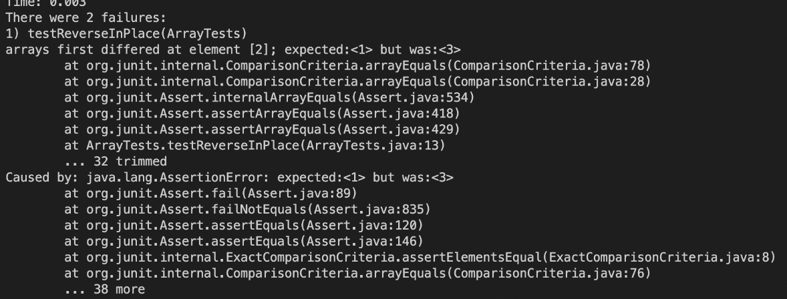
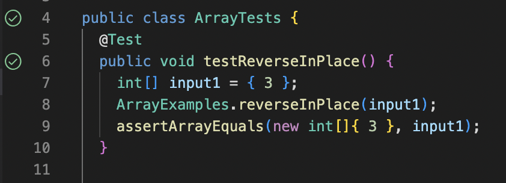

# Lab Report 2
## Part 1: Creating a Web Server
* We will be creating a web server called 'StringServer' which will take incoming requests and print the same string on the screen.
* Strings can be added by using the following request:

  > /add-message?s=<string> 

* Each new string will be added to a new line ("/n").
* For example, if I enter 'localhost:4000/add-message?s=hey_there' the webpage will look like this:  


* We can see that after the _main_ method, the _handleRequest_ method is called.
  * In the main method, the argument is the port number.
  * When the _Handler_ class is called, the new URL is passed.

* Now, if I enter 'add-message?s=whats_up' the webpage will add this new string in a new line and display the message.


* Again, the _handleRequest_ method is called after the _main_ method.
  * In the main method, the argument is the port number.
  * When the _Handler_ class is called, the new URL is passed, which is 'localhost:4000/add-message?s=whats_up'.
  * The value of the URL is saved in the _parameters_ variable, separated by _=_. When we return _parameters[1]_, the value after _=_ (which is 'whats_up') is concatenated to the variable _input_ as a new line. Then, _input_ is printed on the sreen.

* Here's the code for this program:
  
```
import java.io.IOException;
import java.net.URI;

class Handler implements URLHandler {
    // The one bit of state on the server: a number that will be manipulated by
    // various requests.
    String input = "";

    public String handleRequest(URI url) {
        if (url.getPath().equals("/")) {
            return "";
        }
        else if (url.getPath().contains("/add-message")) {
            String[] parameters = url.getQuery().split("=");
            if (parameters[0].equals("s")) {
                input = input + parameters[1] + "\n";
                return input;
            }
        }
        return "404 Not Found!";
        }
    }

class StringServer {
    public static void main(String[] args) throws IOException {
        if(args.length == 0){
            System.out.println("Missing port number! Try any number between 1024 to 49151");
            return;
        }
        int port = Integer.parseInt(args[0]);=
        Server.start(port, new Handler());
    }
}
```

## Part 2: Debugging
- Here's the buggy program that we will be testing today:
 
```
  static void reverseInPlace(int[] arr) {
      for(int i = 0; i < arr.length; i += 1) {
            arr[i] = arr[arr.length - i - 1];
      }
    }
```
                                  
- Now, here is our JUnit test with a failure-inducing input:

```
  @Test 
  public void testReverseInPlace() {
      int[] input2 = {1,2,3};
      ArrayExamples.reverseInPlace(input2);
      assertArrayEquals(new int[]{3,2,1}, input2);
    }
```

- The output for the failure-inducing input:
        



* However, this JUnit test does not induce a failure and passes the test for the buggy code:
                                
```
@Test 
public void testReverseInPlace() {
    int[] input1 = { 3 };
    ArrayExamples.reverseInPlace(input1);
    assertArrayEquals(new int[]{ 3 }, input1);

* The output for the non failure inducing test:                                  
```

                                  

* The symptom: The method _ReverseInPlace()_ needs to change the input array to its reverse. However, what it is doing is that it is taking every element from the end and storing it in the beginning of the array.
  * arr[i] = arr[arr.length - i - 1]
  * This will work fine until the middle of the array. After that it will be wrong as the elements in the first half of the array have been interated over. They are not saved in any other variable either.
                                 
* Here is the buggy program:
 
```
static void reverseInPlace(int[] arr) {
    for(int i = 0; i < arr.length; i += 1) {
         // error
         arr[i] = arr[arr.length - i - 1];
    }
  }
``` 

- Here is the fixed code:
  - Here, we use a new variable, _newArray_ to store the reversed array.
  - Then, we interate over the original array to store each reversed element back in _arr_.                                        
                                  
```
static void reverseInPlace(int[] arr) {
    int[] newArray = new int[arr.length];
    for(int i = 0; i < arr.length; i += 1) {
          newArray[i] = arr[arr.length - i - 1];
    }
    for (int i = 0; i < arr.length; i++) {
          arr[i] = newArray[i];
    }
  }
```                                 
                                   
## Part 3: Learning
 I learnt a lot of new things in week 2 and 3 of CSE15L. I acquired new technical skills and enjoyed the lab work.
  * I learnt how to manipulate webpages, handle requests, and create web servers.
  * I learnt JUnit testing and how to debug code.
  * I understood how to remotely connect to a server.                                
