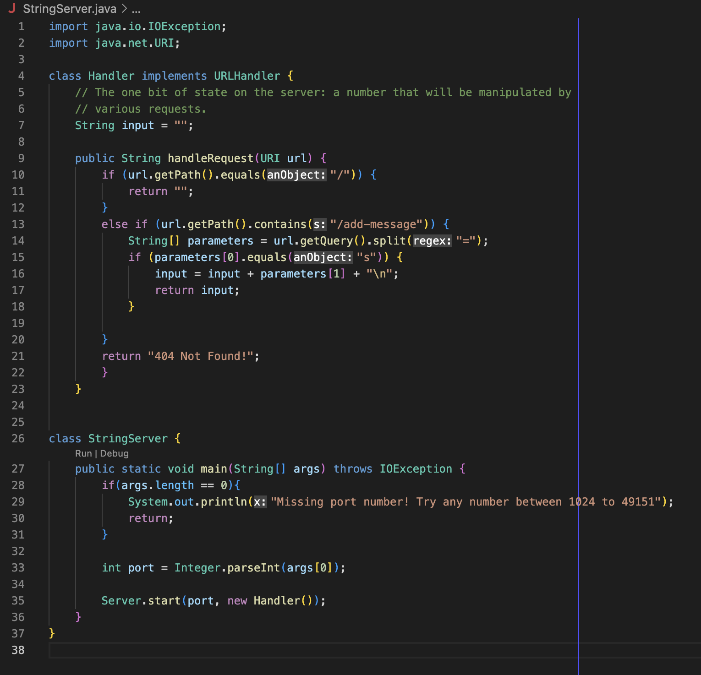

# Lab Report 2
## Part 1: Creating a Web Server
* We will be creating a web server called 'StringServer' which will take incoming requests and print the same string on the screen.
* Strings can be added by using the following request:

> /add-message?s=<string> 
* Each new string will be added to a new line ("/n").
* For example, if I enter 'localhost:4000/add-message?s=hey_there' the webpage will look like this:  

* We can see that after the _main_ method, the _handleRequest_ method is called.
  * In the main method, the argument is the port number.
  * When the _Handler_ class is called, the new URL is passed.

* Now, if I enter 'add-message?s=whats_up' the webpage will add this new string in a new line and display the message.

* Again, the _handleRequest_ method is called after the _main_ method.
  * In the main method, the argument is the port number.
  * When the _Handler_ class is called, the new URL is passed, which is 'localhost:4000/add-message?s=whats_up'.
  * The value of the URL is saved in the _parameters_ variable, separated by _=_. When we return _parameters[1]_, the value after _=_ (which is 'whats_up') is concatenated to the variable _input_ as a new line. Then, _input_ is printed on the sreen.

* Here's the code for this program:
 

